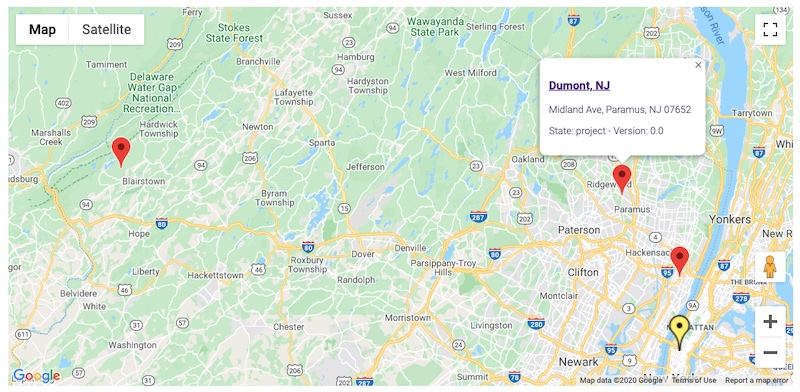

# nuxeo-googlemap-elements

These Polymer Elements allow for displaying a Google Map, possibly with marker(s), handling a click on markers, etc.


# Usage

1. In Nuxeo Studio Designer, "Resources", import the `nuxeo-google-map` folder and its elements, `nuxeo-google-map.html` and `nuxeo-google-maps-api.html`
  * Notice you actually can import the 2 files wherever you want in your tree.
  * _But_ if you don't store them in the same folder, you will need to adapt the import of `nuxeo-google-maps-api` made in `nuxeo-google-map`.
2. In a custom element using them:
  * Import `nuxeo-google-map.html`, according to its path in your configuration
  * For example, `<link rel="import" href="nuxeo-google-map/nuxeo-google-map.html">`
3. It is required to give a height to the element, in the `<style>` part. Then, use the element and set its different values.

For example, with an existing `geoloc` schema:

```
<link rel="import" href="nuxeo-google-map/nuxeo-google-map.html">
<dom-module id="my-element">
  <template>
    <style>
	  nuxeo-google-map {
		height: 500px; /* Settings the height is a requirement */
	  }
    </style
	<nuxeo-google-map
      id="gmap"
      latitude="[[document.properties.geoloc:latitude]]"
      longitude="[[document.properties.geoloc:longitude]]"
      zoom="10"
      api-key="your-API-key"
      markers="[[markers]]"
      fit-to-markers>
   </nuxeo-google-map>
 </template>
. . .
```

`fit-to-markers` allows for automatically zoom the map to include all markers.

`markers` is an array of markerq, each marker has the following properties:

* **Required** Properties:
  * `latitude`:  Required. Number or String. Latitude to center the map.
  * `longitude`:  Required. Number or String. Latitude to center the map.
* Optional Properties:
  * `title`: Tool tip.
  * `infoWindowContent`: Text displayed when te user clicks the marker. Usually HTML, can contain a link, etc.
  * `iconUrl`: The URL to an icon to use instead of the default one.
  * `iconSize`: Size of the icon in pixels (Empty => Default Google size.)


# Example
In this example, a parent company displays a Google Map with markers on each of its subsidiary. Its own marker is different (yellow and bigger). The search is done using the `subsidiaries` page provider, that searches for all subsidiaries of the current document (based on its ID, set as a predicate in the page provider definition). All the documents have the `geoloc` schema. Also, the Google Map Javascript API Key is fetched from the server (stored as a configuration parameter in nuxeo.conf):



```
<link rel="import" href="nuxeo-google-map/nuxeo-google-map.html">
<dom-module id="subsidiaries-search">
  <template>
    <style include="nuxeo-styles">
      nuxeo-google-map {
        height: 600px;
        width: 100%;
      }
    </style>

    <!-- javascript.GetGoogleMapsApiKey reads the Api Key from nuxeo.conf -->
    <nuxeo-operation
          auto
          op="javascript.GetGoogleMapsApiKey"
          on-response="_getApiKeyResponse"></nuxeo-operation>

    <!-- The provider fetches all the subsidiaries of the current document,
         and also loads their geoloc schema -->
    <nuxeo-page-provider id="subsidiariesProvider"
                         provider="subsidiaries"
                         params="[[params]]"
                         schemas="dublincore,common,uid,geoloc"
                         headers='{"X-NXfetch.document": "properties", "X-NXtranslate.directoryEntry": "label"}'>
    </nuxeo-page-provider>
    
    <paper-card id="mapContainer">
      <nuxeo-google-map
        id="gmap"
        api-key="[[apiKey]]"
        latitude="[[document.properties.geoloc:latitude]]"
        longitude="[[document.properties.geoloc:longitude]]"
        markers="[[markers]]"
        fit-to-markers>
      </nuxeo-google-map>
    </paper-card>
  </template>

  <script>

    Polymer({
      is: 'subsidiaries-search',
      behaviors: [Nuxeo.LayoutBehavior],
      properties: {
        document: {
          type: Object,
          observer: "_documentChanged"
        },

        apiKey: String,

        // subsidiariesProvider params
        params: {
          type: Object,
          value: {}
        },

        markers: Array,

      },

      _documentChanged: function(newValue, previousValue) {
        // Need to reset the map if we are changing the document.
        // But as this element could be loaded everywhere (and then, displayed or not
        // depending on a filter), we need to check if it does have the geoloc schema
        if(newValue && !this.hasSchema(newValue, "geoloc")) {
          //console.log(newValue.title + " (" + newValue.type + ") does not have the 'geoloc' schema => not reseting the map");
          return;
        }
        if(previousValue) {
          this.$.gmap.reset({
            latitude: newValue.properties["geoloc:latitude"],
            longitude: newValue.properties["geoloc:longitude"],
            markers: []
          });
        }

        if(newValue) {
          this._search();
        }
      },

      // Using the subsidiaries page provider, which expects this parameter
      // in its predicate (it searches for subsidiaries whose parent company
      // is the current one)
      _setSearchParameters: function() {
        let params = {};
        if(this.document && this.document.properties) {
          params = {
            "system_uuid": this.document.uid
          };
        }
        this.params = params;
      },

      _search: function() {
        if(!this.document) {
          return;
        }

        this._setSearchParameters();
        this.$.subsidiariesProvider.fetch()
            .then(function(response) {

              this._updateMarkers(response);

            }.bind(this))
            .catch(function(error) {

              // . . .

            }.bind(this));
      },

      // Builds an array of markers as expected by nuxeo-google-map
      // Also adds a man marker for the current document, yellow and bigger
      _updateMarkers: function(documents) {

        let markers = [];

        if(!documents || !documents["entity-type"] || documents["entity-type"] !== "documents") {
          console.warn("_updateMarkers: No valid list of documents received");
          return;
        }

        markers.push(this._buildDocumentMarker(this.document));
        // Bigger marker, yello.
        markers[0].iconUrl = "http://maps.google.com/mapfiles/ms/icons/yellow-dot.png";
        markers[0].iconSize = 48;
        // Loop on the others
        for(var doc of documents.entries) {
          if(doc.uid !== this.document.uid) {
            markers.push(this._buildDocumentMarker(doc));
          }
        }

        this.markers = markers;
      },

      // As expected by nuxeo-google-map
      _buildDocumentMarker: function(doc) {

        if(!doc || !doc.properties) {
          return;
        }

        let marker = {
          latitude: doc.properties["geoloc:latitude"],
          longitude: doc.properties["geoloc:longitude"],
          title: doc.title,
          infoWindowContent: this._builContentForInfoWindow(doc)
        };

        return marker;

      },

      _builContentForInfoWindow: function(doc) {

        if(!doc) {
          return "(no input document => no info to display)";
        }
        let contentString;
        if(doc.uid === this.document.uid) {
          contentString = "<h3>" + doc.title + "</h3>";
        } else {
          contentString = "<h3><a href='/nuxeo/ui/#!/doc/" + doc.uid + "'>" + doc.title + "</a></h3>";
        }
        if(doc.properties["dc:description"]) {
          contentString += doc.properties["dc:description"];
        }
        contentString += "<p>State: " + doc.state + "   -   Version: " + doc.properties["uid:major_version"] + "." + doc.properties["uid:minor_version"] +"</p>";

        return contentString;
      },

      _getApiKeyResponse: function(e) {
        if(typeof this.apiKey !== "string" || this.apiKey !== "") {
          this.apiKey = e.detail.response.value;
        }
      },

    });
  </script>
</dom-module>
```

# Support

**These features are not part of the Nuxeo Production platform, they are not supported**

These solutions are provided for inspiration and we encourage customers to use them as code samples and learning resources.

This is a moving project (no API maintenance, no deprecation process, etc.) If any of these solutions are found to be useful for the Nuxeo Platform in general, they will be integrated directly into the platform, not maintained here.

# Licensing

[Apache License, Version 2.0](http://www.apache.org/licenses/LICENSE-2.0)

# About Nuxeo

Nuxeo dramatically improves how content-based applications are built, managed and deployed, making customers more agile, innovative and successful. Nuxeo provides a next generation, enterprise ready platform for building traditional and cutting-edge content-oriented applications. Combining a powerful application development environment with SaaS-based tools and a modular architecture, the Nuxeo Platform and Products provide clear business value to some of the most recognizable brands including Verizon, Electronic Arts, Sharp, FICO, the U.S. Navy, and Boeing. Nuxeo is headquartered in New York and Paris.

More information is available at [www.nuxeo.com](http://www.nuxeo.com).  
